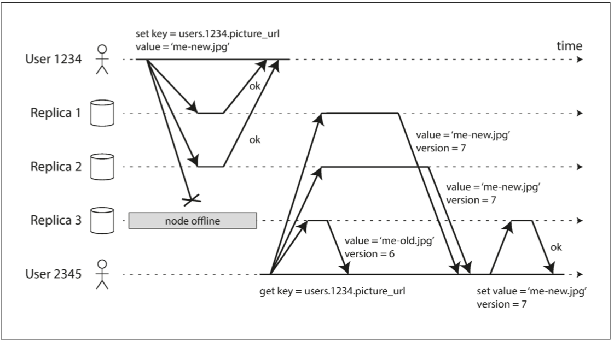

## 数据复制有哪些好处

* 使数据在物理上离用户更近，从而降低访问延迟
* 当部分组件出现故障，系统依然可以继续工作，从而提高可用性
* 扩展至多台机器以同时提供数据访问服务，从而提高吞吐量

## 先看看最常见的场景

### 主从复制

#### 规则

* 只有主节点才能接受写请求
* 可以从主、从节点读取数据
* 主节点接受到写请求之后，首先将新数据写入本地存储，然后将数据更改作为复制日志或更改流发送给所有从节点，从节点获得更改日志之后将其应用到本地

#### 数据复制方式

* 同步复制：等待从节点确认写入完成后返回

  优点：从库保证与主库一致的数据副本

  缺点：一旦某一个从库出现故障，主库就无法进行写入操作。写入延迟较大。

* 异步复制：主节点本地数据写入完成就返回，不等待从节点确认

  优点：延迟较低，吞吐量较高

  缺点：复制滞后问题。主节点故障，可能会造成数据丢失

* 半同步复制：一个从节点开启同步复制，其余从节点异步复制

由于数据副本越多，服务的读请求的吞吐量也就越高，而数据副本越多，意味着发生故障的概率越高，所以通常情况下，同步复制会更加不可靠。

#### 复制滞后问题

##### 读写一致性即写后读一致性

用户提交数据之后，立即查询，可能会出现看起来数据丢失了的问题。

解决方法：

* 客户端记住最近更新的时间戳，并附带在读请求中，如果查出来的数据不够新，则更换数据副本进行读取
* 如果用户访问可能被修改的数据，则从主库读取

如果数据副本分布在不同的数据中心，或者用户从多个设备访问数据，情况就会变得更加复杂。

##### 单调读

用户从不同副本多次读取相同的数据，可能会出现数据回滚的情况。

解决办法：

* 确保同一个用户总是从同一个副本读取数据

##### 前缀一致读

分区数据经多副本复制后出现不同程度的滞后，导致观察者先看到结果后看到起因。

解决方法：

* 有顺序要求的写入都交给一个分区来完成
* Happens-before算法确定前后关系和并发，前后关系数据可直接覆盖，并发需要进行冲突处理

**Happens-before算法：**

* 每个键都对应一个版本号，每次写入都会增加版本号，并将版本号与写入值一起存储
* 客户端读取时，返回所有未覆盖的值和最新的版本号，客户端写入之前必须读取
* 客户端写入时，必须包含之前读取的版本号，并将之前读取的所有值进行合并
* 后端收到具有特定版本号的写入时，它可以覆盖该版本号或更低版本号的所有值，但必须保证更高版本号的所有值

## 多主复制

在单个数据中心内使用多主节点基本没有太大的意义，其复杂度已经超过所能带来的好处。其应用场景主要是为了容忍整个数据中心故障或者更接近用户，从而把数据副本复制到多个数据中心。

### 写冲突

多主复制有一个很明显的缺点：两个数据中心可能会同时修改相同的数据，造成冲突。类似的场景有：协同编辑等。

如何处理写入冲突呢？

#### 避免冲突

解决冲突的最好办法就是避免冲突，应用层来保证对特定记录的写请求总是发往同一个主节点。

#### 收敛至一致

* 给每个写入分配唯一ID，挑选ID最大的写入为胜利者。会造成数据丢失
* 给每个副本分配唯一ID，制定优先级规则，例如序号高的副本写入始终优先于序号低的副本。同理，也会造成数据丢失
* 以某种规则将数据合并
* 预定义格式来记录冲突信息，由应用层来事后解决

#### 自定义冲突解决

解决冲突最合适的方式还是依靠应用层，所以在大多数多主节点复制模型都有工具让用户编写应用代码来解决冲突。

写入时执行：只要在复制变更日志时检测到冲突，就调用应用层的冲突处理程序，这种方式一般只能在后台运行。

读取时执行：写入冲突时，将信息记录下来。下一次读取时，将数据的多个版本返回给应用层，应用层选择提示用户或者自动解决冲突。

#### 自动冲突解决

* 无冲突的复制数据类型（CRDT）。CRDT是可由多个用户同时编辑的数据结构，并以内置的合理方式解决冲突。

* 可合并的数据结构。跟踪变更历史，类似于Git版本控制系统。

* 操作转换。是协作编辑Etherpad和Google Docs的冲突解决算法。

  

## 无主节点复制

即没有主节点，允许所有副本接受来自客户端的写请求。在此模式中，不存在故障切换。

假如有3个副本，用户同时向3个副本发起写请求，有两个成功确认，即可认为写入成功。可以忽略另一个副本无法写入的情况。

**读修复**：读取数据时，用户也是并行的向多个副本发起读请求，根据版本号取到最新的数据，并对旧值副本进行修复。

**反熵过程：**一些数据存储会有后台进程不断查找副本之间的数据差异，并对缺少的数据进行复制。

### 多数据中心

无主节点复制也适用于多数据中心。

每个写入操作会发送给多个数据中心的所有副本，但只会等待本地数据中心内quorum节点数的确认，这样避免了高延迟和跨数据中心的网络异常。对远程数据中心的写入，通常是使用异步方式。（Cassandra/Voldemort）

另外一种方式是将客户端与数据库节点之间的通信限制在一个数据中心内。跨数据中心的复制在后台异步允许，类似于多主节点复制。(Riak)

【参考资料】

[Designing Data-Intensive Applications](https://github.com/Vonng/ddia/blob/master/ch5.md)

